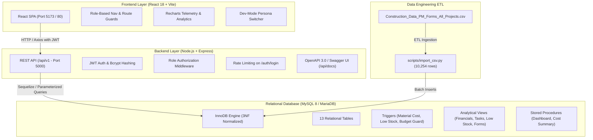
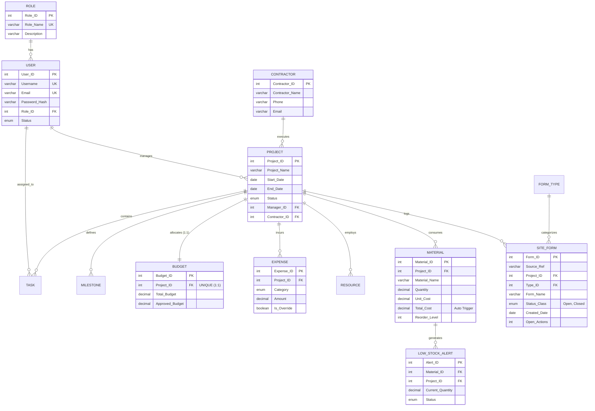

# BuildCorp – Construction Management System (DBMS Project)
**SRM Institute of Science and Technology**  
**Department of Computer Science and Engineering (AIML)**  
*Course:* Database Management Systems Laboratory (18CSC303J / Equivalent)  
*Academic Project:* Full-Stack Enterprise Construction Management & Multi-Site Telemetry Platform

---

## 🌟 Executive Summary

**BuildCorp** is an enterprise-grade, role-based construction management platform that replaces paper-based site logbooks, disconnected spreadsheets, and manual daily diaries with a unified, real-time relational database system.

### Key Pain Points Solved
1. **Data Loss from Manual Logbooks:** Centralizes daily inspection records with audit trails and automated backups.
2. **Unexpected Material Stockouts:** Proactive database triggers automatically monitor threshold levels (`Quantity <= Reorder_Level`) and log instant alerts to `LOW_STOCK_ALERT`.
3. **Uncontrolled Budget Overruns:** Automated triggers block unauthorized expenses that exceed the project's `Approved_Budget` unless an explicit manager override is flagged.
4. **Site-to-Office Disconnect:** Role-specific dashboards unify executives, site engineers, accountants, and field supervisors with high-speed query views.
5. **Real-World Inspection Data Ingestion:** Production-grade ETL pipeline has ingested **10,254 historical site inspection records** across 8 projects with 100% data reconciliation.

---

## 🏗️ System Architecture



---

## 📊 Relational Database Design (3NF)



### Relational Schema Highlights
1. **13 Tables:** `ROLE`, `USER`, `CONTRACTOR`, `PROJECT`, `TASK`, `MILESTONE`, `BUDGET`, `EXPENSE`, `RESOURCE`, `MATERIAL`, `LOW_STOCK_ALERT`, `FORM_TYPE`, `SITE_FORM`.
2. **Database Triggers:**
   - `trg_material_before_insert / update`: Computes `Total_Cost = Quantity × Unit_Cost`.
   - `trg_material_after_insert / update`: Evaluates `Quantity <= Reorder_Level` and writes/resolves records in `LOW_STOCK_ALERT`.
   - `trg_expense_before_insert`: Enforces that cumulative expenses (`SUM(Amount) + NEW.Amount`) cannot exceed `Approved_Budget` without `Is_Override = TRUE`.
3. **Analytical Views:**
   - `v_project_financials`: Approved budget, spent, remaining, % utilized.
   - `v_task_status_counts`: Task counts by lifecycle and completion percentage.
   - `v_low_stock`: Active stock items at or below reorder threshold.
   - `v_form_summary_by_project`: Aggregated site forms, open actions, and stale forms.
4. **Stored Procedures:**
   - `sp_project_dashboard(project_id)`: Multi-dimensional 360-degree project telemetry.
   - `sp_payroll_or_cost_summary(project_id)`: Categorical expense and resource valuation.

---

## 📈 Real Dataset Ingestion (10,254 Rows)

The platform ingests the production dataset `Construction_Data_PM_Forms_All_Projects.csv` spanning historical construction records:
- **Total Records:** 10,254 rows
- **Date Span:** 26-Feb-2019 to 16-Sep-2020 (Parsed strictly with `dayfirst=True` to guarantee DD/MM/YYYY accuracy)
- **Project IDs & Row Distribution:**
  - Project 1328: **4,043 rows** [100% Match]
  - Project 1330: **2,149 rows** [100% Match]
  - Project 1329: **1,212 rows** [100% Match]
  - Project 1335: **804 rows** [100% Match]
  - Project 1340: **744 rows** [100% Match]
  - Project 1338: **510 rows** [100% Match]
  - Project 1343: **396 rows** [100% Match]
  - Project 1345: **396 rows** [100% Match]
- **Status Class:** Closed: 7,535 | Open: 2,717 | Null: 2
- **Query Performance:** Site Forms statistical aggregation executes in **~78 ms** (<500 ms target) via composite indexes on `SITE_FORM(Project_ID, Created_Date, Type_ID, Status_Class)`.

---

## 👥 Demo Personas & Credentials

All demo user passwords are encrypted with bcrypt (rounds = 10):

| Full Name | Role | Username / Login Identifier | Password | Access Scope |
| :--- | :--- | :--- | :--- | :--- |
| **Alex Vance** | Admin | `alex.vance` or `alex.vance@buildcorp.com` | `Demo@123` | Complete system CRUD, User Governance & Reports |
| **Sarah Jenkins** | Project Manager | `sarah.jenkins` or `sarah.jenkins@buildcorp.com` | `Demo@123` | Multi-site projects, tasks, budgets, materials |
| **Rajesh Patel** | Site Engineer | `rajesh.patel` or `rajesh.patel@buildcorp.com` | `Demo@123` | Daily tasks, materials tracking, site forms QA/QC |
| **Elena Rostova** | Accountant | `elena.rostova` or `elena.rostova@buildcorp.com` | `Demo@123` | Budgets, expenses, contractor invoices, fiscal exports |
| **Marcus Brody** | Site Supervisor | `marcus.brody` or `marcus.brody@buildcorp.com` | `Demo@123` | Field work tasks, material stock updates (no finance) |

> 💡 **Evaluator Note:** You can switch between personas in one click using the **"Switch Role"** button in the top navigation bar without manual logout/login.

---

## 🚀 Running the Project

### Option A: Local Full-Stack Execution

#### 1. Database Setup
Start MySQL (e.g. via XAMPP or native service on port 3306), then apply schema and seed data:
```powershell
# From project root
& "C:\xampp\mysql\bin\mysql.exe" -u root -e "source ./backend/schema.sql"
& "C:\xampp\mysql\bin\mysql.exe" -u root -D construction_db -e "source ./scripts/seed_demo.sql"
python scripts/import_csv.py
```

#### 2. Backend Setup
```powershell
cd backend
npm install
npm start
# Server starts at http://localhost:5000
# OpenAPI / Swagger Docs: http://localhost:5000/api/docs
```

#### 3. Frontend Setup
```powershell
cd frontend
npm install
npm run dev
# Vite runs at http://localhost:5173
```

---

### Option B: Docker Compose (All-in-One)
```bash
docker-compose up --build -d
```
Services spun up:
- `mysql`: Database initialized with schema and seed data on port 3306.
- `api`: Node.js Express REST API on port 5000.
- `web`: Nginx serving optimized React SPA on port 80.

---

## 🧪 Automated Test Suite

Run backend Jest test suite:
```powershell
cd backend
npm test
```
**Results:** 3 Test Suites, 13 Tests Passing:
- `auth.test.js`: JWT login, invalid password rejection, profile retrieval, route protection.
- `project.test.js`: Project summaries, material cost calculation hook, low stock flags, RBAC deletion rejection.
- `integration.test.js`: Role 403 authorization enforcement, role listing, site forms pagination, report CSV exports.

---

## 📸 Screenshots Checklist for Viva & Submission

When presenting the project or preparing project report appendices, capture screenshots of:
- [ ] **Login Screen:** Clean glassmorphism dark theme with demo credentials helper.
- [ ] **Executive Dashboard:** 4 KPI cards, "Budget vs. Actual Spent" Bar Chart, "Task Distribution" Donut Chart.
- [ ] **Site Forms Intelligence Section:** Monthly line chart (2019-02 to 2020-09), group distribution, open action counts.
- [ ] **Site Forms Explorer (`/forms`):** 10,254-row table with live filters (Project, Type, Group, Status, Date) and CSV export.
- [ ] **Low-Stock Alert Table:** Inventory items triggering active alerts when `Quantity <= Reorder_Level`.
- [ ] **Budget Guard Trigger Modal:** Error rejection when cumulative expenses exceed `Approved_Budget` without override.
- [ ] **Quick Persona Switcher:** Top bar dropdown switching roles from Admin to Accountant to Site Supervisor.
- [ ] **Swagger API Explorer (`/api/docs`):** Interactive OpenAPI 3.0 endpoint documentation.
