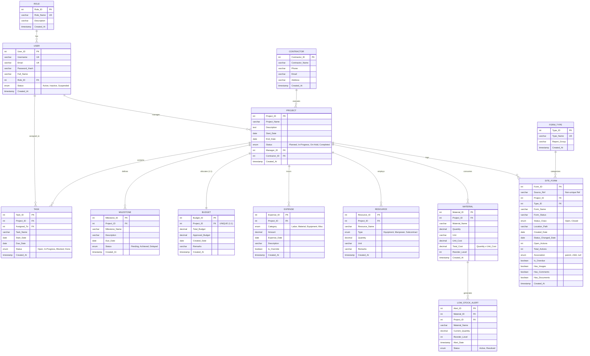

# Entity Relationship (ER) Diagram
## BuildCorp – Construction Management System (DBMS Project)
**Department of CSE (AIML), SRM Institute of Science and Technology**

---

### 1. Conceptual & Relational Data Model (Mermaid ERD)

---

### 2. Normalization Verification (3NF Compliance)

1. **1NF (First Normal Form):**
   - All tables possess primary keys (`Role_ID`, `User_ID`, `Contractor_ID`, `Project_ID`, etc.).
   - All attributes contain atomic, single-valued entries (e.g., individual amounts, scalar dates).
   - No repeating groups or array values.

2. **2NF (Second Normal Form):**
   - 1NF is fully satisfied.
   - All non-key attributes are fully functionally dependent on the entire primary key (all tables utilize single-column surrogate primary keys, thus eliminating partial dependencies).

3. **3NF (Third Normal Form):**
   - 2NF is fully satisfied.
   - Every non-key attribute depends only directly on the primary key, with zero transitive dependencies (e.g., User role attributes reside in `ROLE`, not duplicated in `USER`; Contractor details reside in `CONTRACTOR`, referenced via `Contractor_ID` foreign key in `PROJECT`).

---

### 3. Business Constraints, Triggers & Invariants

| Trigger / Constraint | Target Table | Timing / Event | Business Logic Enforcement |
| :--- | :--- | :--- | :--- |
| `trg_material_before_insert` | `MATERIAL` | `BEFORE INSERT` | Automatically computes `NEW.Total_Cost = ROUND(NEW.Quantity * NEW.Unit_Cost, 2)`. |
| `trg_material_before_update` | `MATERIAL` | `BEFORE UPDATE` | Automatically re-computes `NEW.Total_Cost = ROUND(NEW.Quantity * NEW.Unit_Cost, 2)` upon quantity or unit cost changes. |
| `trg_material_after_insert` | `MATERIAL` | `AFTER INSERT` | Evaluates if `Quantity <= Reorder_Level`. If true, automatically logs an alert into `LOW_STOCK_ALERT`. |
| `trg_material_after_update` | `MATERIAL` | `AFTER UPDATE` | If stock level drops below or equal to `Reorder_Level`, inserts or updates active alert. If replenished above `Reorder_Level`, automatically marks active alert as `'Resolved'`. |
| `trg_expense_before_insert` | `EXPENSE` | `BEFORE INSERT` | Queries `BUDGET.Approved_Budget` and cumulative expenses `SUM(Amount)`. Rejects transaction with SQLSTATE `'45000'` if budget is exceeded, unless `Is_Override = TRUE`. |
